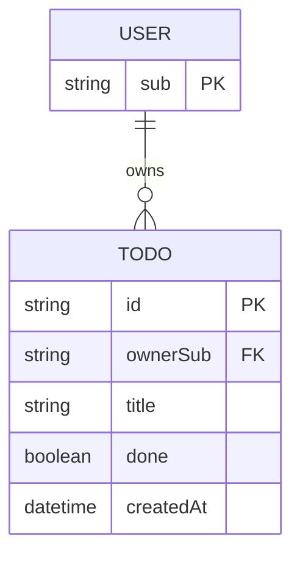

# Domain model

A signed-in user owns todos; each todo is a short title that is either open or done.

The user is identified only by the sign-in subject; no user table is kept. `done` only moves from false to true.