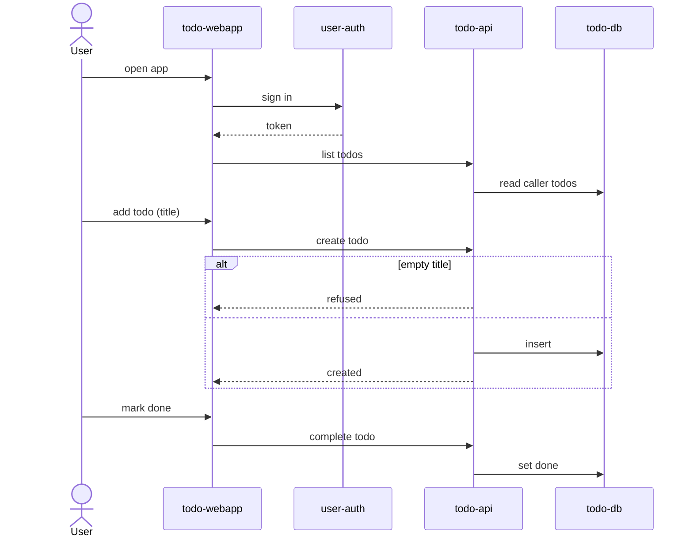

# Manage todos

A User signs in, adds a todo and marks it done.

```mermaid
sequenceDiagram
    actor User
    participant todo-webapp
    participant user-auth
    participant todo-api
    participant todo-db

    User->>todo-webapp: open app
    todo-webapp->>user-auth: sign in
    user-auth-->>todo-webapp: token
    todo-webapp->>todo-api: list todos
    todo-api->>todo-db: read caller todos
    User->>todo-webapp: add todo (title)
    todo-webapp->>todo-api: create todo
    alt empty title
        todo-api-->>todo-webapp: refused
    else
        todo-api->>todo-db: insert
        todo-api-->>todo-webapp: created
    end
    User->>todo-webapp: mark done
    todo-webapp->>todo-api: complete todo
    todo-api->>todo-db: set done
```